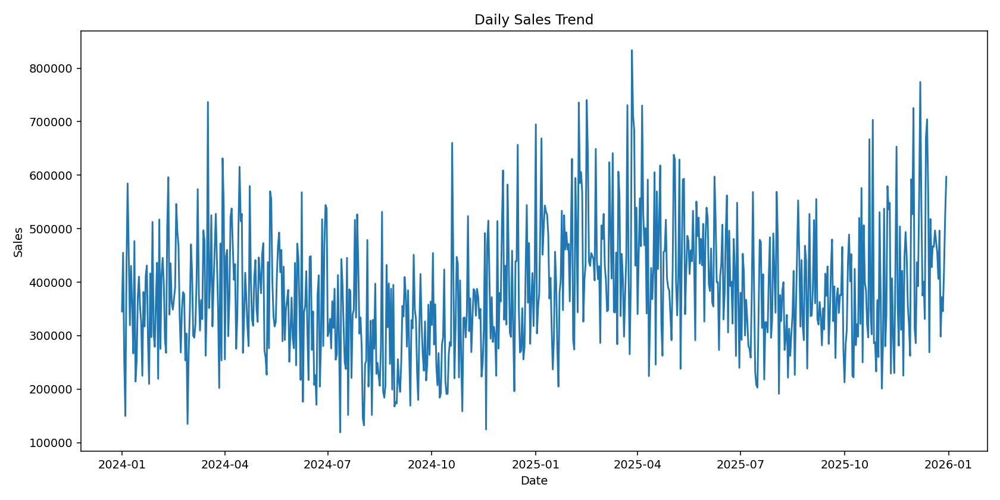
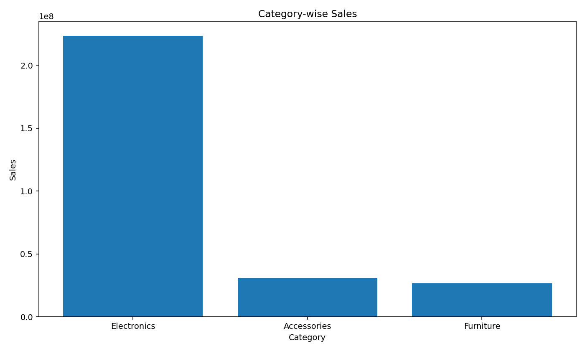
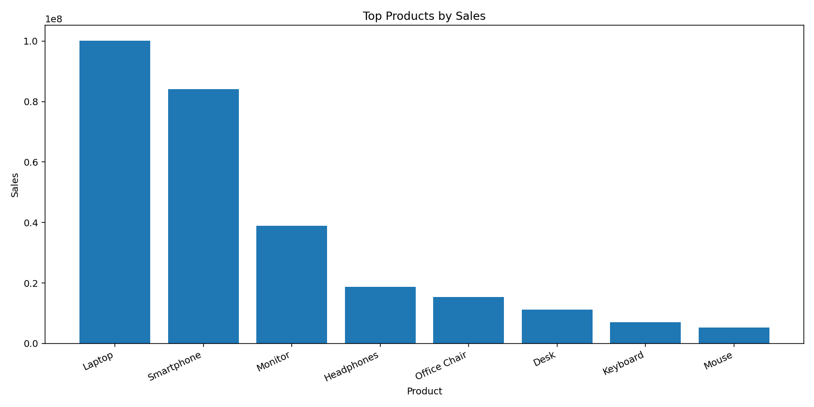
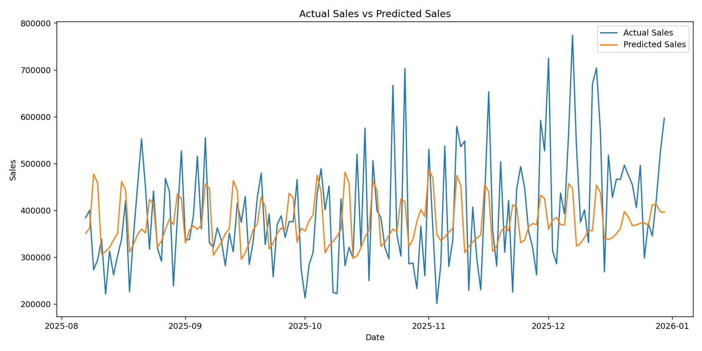
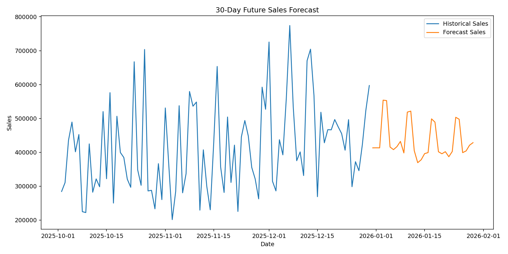
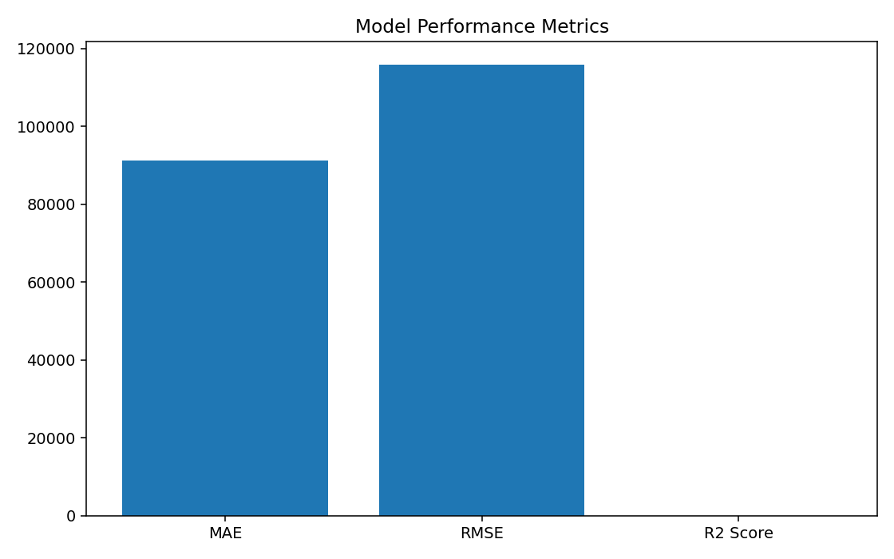

InternID : CITS4379

# Sales Forecasting Dashboard using Machine Learning

## Intern Details

| Field | Value |
|---|---|
| Intern ID | YOUR_INTERN_ID |
| Full Name | YOUR_FULL_NAME |
| No. of Weeks | YOUR_WEEK_COUNT |
| Project Name | Sales Forecasting Dashboard using Machine Learning |

## Project Scope

This project is a complete machine learning based sales forecasting dashboard. The application allows a user to upload historical sales data, analyze sales performance, train a forecasting model, predict future sales and download forecast results.

The project is designed as a practical business dashboard that can help a store owner, sales team or business analyst understand past sales trends and estimate future sales demand.

## Key Features

- Upload sales CSV file
- Validate required dataset columns
- Clean and preprocess sales data
- View sales KPIs such as total sales, average daily sales and highest daily sales
- Analyze daily, monthly, category-wise and product-wise sales
- Train a machine learning model using historical sales data
- Forecast future sales for 7, 15, 30, 60, 90 or 180 days
- View actual sales vs predicted sales
- View model performance metrics: MAE, RMSE and R² Score
- Download forecast result as CSV
- Includes sample dataset, trained model, output images and documentation

## Technologies Used

| Area | Technology |
|---|---|
| Programming Language | Python |
| Web App / UI | Streamlit |
| Data Processing | Pandas, NumPy |
| Machine Learning | Scikit-learn |
| Model | Random Forest Regressor |
| Charts | Plotly, Matplotlib |
| Model Saving | Joblib |

## Folder Structure

```text
sales-forecasting-ml-dashboard/
│
├── app.py
├── README.md
├── requirements.txt
├── .gitignore
│
├── data/
│   └── sample_sales_data.csv
│
├── models/
│   └── sales_forecasting_model.pkl
│
├── src/
│   ├── __init__.py
│   ├── data_preprocessing.py
│   ├── model_training.py
│   ├── forecasting.py
│   ├── visualization.py
│   └── utils.py
│
├── screenshots/
│   ├── sales_trend.png
│   ├── category_sales.png
│   ├── top_products.png
│   ├── actual_vs_predicted.png
│   ├── forecast_result.png
│   └── model_performance.png
│
├── output/
│   ├── forecast_output.csv
│   └── forecast_summary.csv
│
├── documentation/
│   └── project_documentation.md
│
└── scripts/
    ├── generate_sample_data.py
    └── generate_project_outputs.py
```

## Dataset Format

The application expects a CSV file with the following columns:

| Column | Description |
|---|---|
| Date | Sales transaction date |
| Product | Product name |
| Category | Product category |
| Sales | Total sales amount |
| Quantity | Quantity sold |
| Price | Product price |

Example:

```csv
Date,Product,Category,Sales,Quantity,Price
2024-01-01,Laptop,Electronics,55000,1,55000
2024-01-02,Mouse,Accessories,1600,2,800
2024-01-03,Keyboard,Accessories,3000,2,1500
```

## How the Project Works

```text
User uploads sales CSV
        ↓
Application validates and cleans data
        ↓
Daily sales are aggregated
        ↓
Date-based ML features are created
        ↓
Random Forest model is trained
        ↓
User selects forecast period
        ↓
Future sales are predicted
        ↓
Forecast table, charts and metrics are displayed
        ↓
User can download forecast CSV
```

## Machine Learning Approach

The model predicts future sales using date-based features created from historical sales dates.

Features used by the model:

- DayIndex
- Year
- Month
- Day
- DayOfWeek
- WeekOfYear
- Quarter
- IsWeekend
- IsMonthStart
- IsMonthEnd

The target column is:

- Sales

The project uses `RandomForestRegressor` because it works well for tabular data and can learn non-linear sales patterns.

## How to Run the Project

### 1. Clone the Repository

```bash
git clone https://github.com/YOUR_USERNAME/sales-forecasting-ml-dashboard.git
cd sales-forecasting-ml-dashboard
```

### 2. Create Virtual Environment

```bash
python -m venv venv
```

### 3. Activate Virtual Environment

For Windows:

```bash
venv\Scripts\activate
```

For macOS/Linux:

```bash
source venv/bin/activate
```

### 4. Install Dependencies

```bash
pip install -r requirements.txt
```

### 5. Run the Streamlit App

```bash
streamlit run app.py
```

The app will open in your browser.

## Regenerate Output Files

To regenerate the model, forecast CSV and chart images, run:

```bash
python scripts/generate_project_outputs.py
```

## Screenshots / Output Images

### Sales Trend



### Category-wise Sales



### Top Products



### Actual vs Predicted Sales



### Forecast Result



### Model Performance



## Output Files

| File | Description |
|---|---|
| output/forecast_output.csv | 30-day future sales forecast result |
| output/forecast_summary.csv | Forecast summary values |
| models/sales_forecasting_model.pkl | Trained machine learning model |

## Project Conclusion

This project demonstrates an end-to-end machine learning workflow for sales forecasting. It includes data upload, preprocessing, exploratory analysis, model training, future forecasting, visualization and downloadable outputs. The dashboard can be used as a practical business tool to estimate future sales and support planning decisions.
